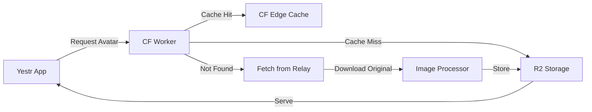

# Yestr Face - Profile Picture Proxy Server

A high-performance profile picture proxy server built on Cloudflare Workers with R2 storage, designed to solve CORS issues and provide reliable image serving for the Yestr app.

## Features

- 🚀 **Fast Edge Caching** - Images served from Cloudflare's global network
- 🔒 **CORS Compliant** - Proper CORS headers for web applications
- 📦 **R2 Storage** - Cost-effective object storage for millions of images
- 🔄 **Auto-sync** - Automatically fetches and updates profile pictures from Nostr relays
- 🖼️ **Image Optimization** - Multiple sizes and WebP conversion
- ⚡ **High Performance** - Request coalescing and intelligent caching

## Quick Start

```bash
# Clone the repository
git clone https://github.com/yourusername/yestr-face.git
cd yestr-face

# Install dependencies
npm install

# Configure your Cloudflare account
wrangler login

# Deploy to Cloudflare Workers
npm run deploy
```

## API Endpoints

### Get Avatar

```
GET /avatar/:pubkey
```

Query Parameters:

- `size` - Image size (200, 400, 800)
- `format` - Image format (webp, jpg, png)

Example:

```
https://avatars.yestr.app/avatar/e0f6050d930a61323bac4a5b47d58e961da2919834f3f58f3b312c2918852b55?size=400&format=webp
```

### Health Check

```
GET /health
```

Returns service status and connectivity information.

## Documentation

- [Development Plan](./DEVELOPMENT_PLAN.md) - Technical architecture and implementation details
- [Deployment Guide](./DEPLOYMENT_GUIDE.md) - Step-by-step deployment instructions

## Architecture



## Development

```bash
# Run locally
npm run dev

# Run tests
npm test

# Type checking
npm run type-check

# Linting
npm run lint

# Format code
npm run format
```

## Configuration

See `wrangler.toml` for configuration options. Sensitive values should be set as secrets:

```bash
wrangler secret put R2_ACCESS_KEY_ID
wrangler secret put R2_SECRET_ACCESS_KEY
wrangler secret put ALLOWED_ORIGINS
```

## Performance

- Average response time: <100ms for cached images
- Cache hit rate: >90% after warm-up
- Storage efficiency: ~70% reduction with WebP conversion
- Bandwidth savings: ~60% with optimized images

## Contributing

1. Fork the repository
2. Create your feature branch (`git checkout -b feature/amazing-feature`)
3. Commit your changes (`git commit -m 'Add amazing feature'`)
4. Push to the branch (`git push origin feature/amazing-feature`)
5. Open a Pull Request

## License

This project is licensed under the MIT License - see the LICENSE file for details.

## Support

For issues and feature requests, please use the GitHub issue tracker.

---

Built with ❤️ for the Nostr community
